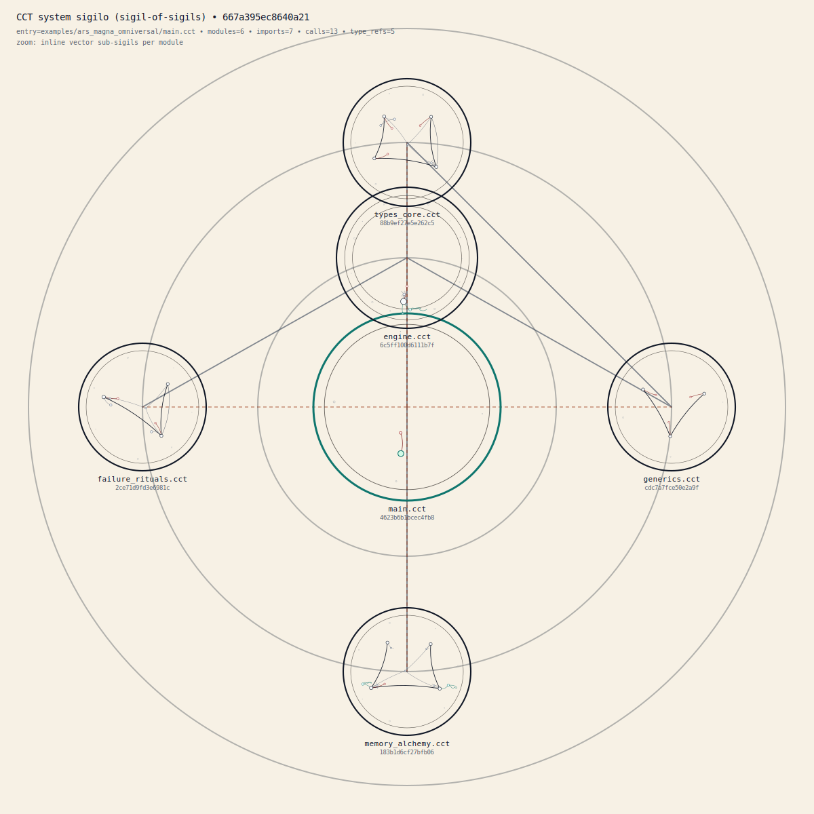

# CCT — Clavicula Turing

> "To name is to invoke. To invoke is to bind. To bind is to compute."

CCT is a compiled, ritual-themed programming language with deterministic sigil generation.

<div align="center">
  
  <p><em>System sigil generated from a multi-module CCT program (Ars Magna Omniversal)</em></p>
  <p><sub>Each program generates a unique, deterministic visual sigil representing its structure, calls, and module dependencies</sub></p>
  <p><sub>Open the SVG in a browser and hover the circles and lines: sigilo components now reveal ritual names, statement kinds, call edges, and source context through native SVG tooltips.</sub></p>
</div>

<div align="center">
  
  <p><em>Animated execution trace from the creator-platform example — open in a browser to watch it play</em></p>
  <p><sub>FASE 39: live trace correlation overlaid on the route sigil. Each span is color-coded by operational category (SQL, cache, storage, transcode, mail, auth…) and arrives at its node in temporal order. The timeline below shows relative durations per depth layer. Slow spans glow; unresolved spans are never silently dropped.</sub></p>
</div>

## Status

**Current status: FASE 39 completed** (security/cryptography, advanced text and parsing, logging and runtime diagnostics, Sigilo Vivo foundations, operational database, transactional mail, runtime instrumentation, and trace visualization are now closed on the validated baseline).

Implemented phases: **0 -> 39**, plus the interstitial **FASE 14T** closure.

**Phase-reference convention:** phase labels found in file/module headers, local markers, or help text may refer to the phase in which that specific component was introduced or stabilized. They are historical markers and do not necessarily represent the current global project status shown above.

Highlights of the current baseline:
- Real end-to-end compiler pipeline (`.cct -> parse/semantic -> codegen -> .cgen.c -> host C compiler -> binary`)
- Deterministic sigil generation (`.svg` + `.sigil`) integrated into normal compile and `--sigilo-only`
- Sigils are no longer static pictures only: local and system SVG components can be hovered directly in the browser
- Multi-module support with `ADVOCARE`, cycle detection, direct-import visibility rules, and internal visibility via `ARCANUM`
- Modular sigils with two official emission modes (`essencial` / `completo`, aliases `essential` / `complete`)
- Advanced typing subset consolidated: `GENUS`, `PACTUM`, and basic constraints `GENUS(T PACTUM C)`
- Bibliotheca Canonica foundation: reserved namespace `cct/...` with canonical stdlib resolution
- Canonical text-core module: `cct/verbum` (`len`, `concat`, `compare`, `substring`, `trim`, `contains`, `find`)
- Canonical formatting/conversion module: `cct/fmt` (`stringify_*`, `fmt_parse_*`, `format_pair`)
- Canonical static-collection module: `cct/series` (`series_len`, `series_fill`, `series_copy`, `series_reverse`, `series_contains`)
- Canonical baseline algorithms module: `cct/alg` (`alg_linear_search`, `alg_compare_arrays`, `alg_binary_search`, `alg_sort_insertion`)
- Canonical memory utility module: `cct/mem` (`alloc`, `free`, `realloc`, `copy`, `set`, `zero`, `mem_compare`)
- Canonical dynamic-vector module: `cct/fluxus` (`fluxus_init`, `fluxus_free`, `fluxus_push`, `fluxus_pop`, `fluxus_len`, `fluxus_get`, `fluxus_clear`, `fluxus_reserve`, `fluxus_capacity`)
- Canonical IO module: `cct/io` (`print`, `println`, `print_int`, `read_line`)
- Canonical filesystem module: `cct/fs` (`read_all`, `write_all`, `append_all`, `exists`, `size`)
- Canonical path module: `cct/path` (`path_join`, `path_basename`, `path_dirname`, `path_ext`)
- Canonical math module: `cct/math` (`abs`, `min`, `max`, `clamp`)
- Canonical random module: `cct/random` (`seed`, `random_int`, `random_real`)
- Canonical parse module: `cct/parse` (`parse_int`, `parse_real`, `parse_bool`)
- Canonical compare module: `cct/cmp` (`cmp_int`, `cmp_real`, `cmp_bool`, `cmp_verbum`)
- Canonical Option/Result modules: `cct/option` and `cct/result` (`Some`/`None`, `Ok`/`Err`, `unwrap`/`unwrap_or`/`expect`)
- Moderate canonical algorithm extras: `cct/alg` (`alg_binary_search`, `alg_sort_insertion`)
- Canonical public showcases for stdlib usage (`string`, `collection`, `io/fs`, `parse/math/random`, `multi-module`)
- Sigilo metadata now exposes stdlib usage counters and module list in showcase/public flows
- Final stdlib stability matrix and release notes are published for the 11H freeze
- Relocatable distribution bundle (`make dist`) with wrapper-based stdlib resolution
- Structured diagnostics with source snippets and actionable suggestions (FASE 12A)
- Numeric cast expression baseline (`cast GENUS(T)(value)`) in FASE 12B
- Functional error ergonomics via Option/Result in FASE 12C
- Hash-backed canonical collections via `cct/map` and `cct/set` in FASE 12D.1
- Functional collection combinators via `cct/collection_ops` in FASE 12D.2 (`fluxus_map`, `fluxus_filter`, `fluxus_fold`, `fluxus_find`, `fluxus_any`, `fluxus_all`, `series_map`, `series_filter`, `series_reduce`, `series_find`, `series_any`, `series_all`)
- Baseline collection iterator syntax from FASE 12D.3, expanded in FASE 19D.1 to `map`/`set` (`ITERUM key, value IN map` and `ITERUM item IN set`)
- Standalone formatter command in FASE 12E.1 (`cct fmt`, `cct fmt --check`, `cct fmt --diff`)
- Canonical linter command in FASE 12E.2 (`cct lint`, `cct lint --strict`, `cct lint --fix`)
- Canonical project workflow in FASE 12F (`cct build`, `cct run`, `cct test`, `cct bench`, `cct clean`) with basic incremental cache
- Canonical documentation generator in FASE 12G (`cct doc`) for module/symbol API pages (markdown/html)
- Common math operators in FASE 13M: `**` (power), `//` (floor integer division), `%%` (euclidean modulo)
- FASE 14A hardening: canonical diagnostic taxonomy + canonical exit-code contract + sigilo explain mode + deterministic sigilo diagnostic ordering
- FASE 14T sigilo instrumentation: native SVG `<title>` hover on semantic elements, deterministic additive `data-*` on local nodes/call edges, lightweight root semantics, and explicit enable/disable toggles
- FASE 15 closure set: `FRANGE`/`RECEDE` loop-control stability, logical `ET`/`VEL` with precedence/parentheses, stable bitwise/shift operators, and `CONSTANS` semantic+codegen enforcement (locals, parameters, and const-pointer binding)
- FASE 16 closure set: freestanding profile (`--profile freestanding`), bridge-safe `cct/kernel`, ASM emission path (`--emit-asm`), and bridge packaging gates
- FASE 17/18 canonical-library expansion: text/parsing/IO/FS/path utilities, algorithms/collections growth, plus `process`, `hash`, and `bit` modules
- FASE 19 language-surface expansion: `ELIGE`/`CASUS`/`ALIOQUIN` (with legacy `CUM` compatibility), `FORMA`, payload `ORDO`, and `ITERUM` over `map`/`set` with insertion-order semantics
- FASE 20 application-library expansion: `cct/json`, `cct/socket`, `cct/net`, `cct/http`, `cct/config`, and `cct/db_sqlite`
- FASE 21-29 bootstrap closure: lexer, parser, semantic analyzer, codegen, stage0/stage1/stage2 self-host convergence
- FASE 30 operational closure: self-hosted project workflows, mature `csv` / `https` / `orm_lite`, and final operational handoff
- FASE 31 promotion closure: `./cct` is now the default wrapper, with `./cct-host` and `./cct-selfhost` exposed explicitly and `./cct --which-compiler` reporting the active mode
- Aggregated whole-project validation now extends through promotion with `make test-all-0-31` and `make test-phase31-final`
- FASE 32 security/media: `cct/crypto` (SHA-256/512, HMAC, PBKDF2, CSPRNG), `cct/encoding` (base64, hex, URL, HTML), `cct/regex`, `cct/date`/`cct/datetime`, `cct/toml`, `cct/compress` (gzip), `cct/filetype`, `cct/media_probe`, `cct/image_ops`, `cct/text_lang`
- FASE 33 text and parsing: `cct/verbum` expansion (split/join, predicates, pad, repeat, regex-split), `cct/lexer_util`, `cct/uuid` (v4/v7), `cct/slug`, `cct/gettext`, `cct/form_codec`
- FASE 34 observability: `cct/log` (structured, sinks, rate-limiting), `cct/trace` (spans, `.ctrace` format), `cct/metrics` (counter/gauge/histogram, Prometheus export), `cct/signal`, `cct/fs_watch`, `cct/audit`
- FASE 35 Sigilo Vivo foundations: route structural metadata, web-focused navigable SVG, `.ctrace` viewer CLI (`cct sigilo trace view`), external framework manifests (`.system.sigil`)
- FASE 36 operational database: `cct/db_postgres` (prepared statements, LISTEN/NOTIFY, JSONB/ARRAY/UUID), `cct/db_postgres_search` (FTS builders, GIN index), `cct/redis` (strings/hashes/lists/sets/pub-sub, raw RESP escape hatch), `cct/db_postgres_lock` (advisory locks, try-lock, lock-with)
- FASE 37 transactional mail: `cct/mail` (SMTP with PLAIN/LOGIN/STARTTLS/SMTPS, file/memory backends), `cct/mail_spool` (persistent queue with exponential-backoff retry), `cct/mail_webhook` (delivery/bounce/complaint normalization for Mailgun/SendGrid)
- FASE 38 runtime instrumentation: `cct/instrument` (span emission by category: DB/CACHE/STORAGE/MAIL/TASK/HTTP; off-by-default, zero overhead when inactive), `cct/context_local` (request/task-scoped key-value store for `request_id`, `trace_id`, `user_id`, `locale`, `route_id`)
- FASE 39 trace visualization: animated SVG renderer overlaying `.ctrace` onto route sigil (timeline, step-by-step, comparison mode), operational category overlay system with stable color palette and exportable CSS (`cct sigilo trace render`, `cct sigilo trace compare`)

## Documentation

CCT documentation is organized by audience and purpose. Choose your reading path:

### For New Users (Start Here)
1. This README (you're reading it!)
2. [Installation Guide](docs/install.md) - Setup and verification
3. [Current Release Status Through FASE 31](docs/release/STATUS_0_31.md) - Compiler and bootstrap validated baseline at a glance
4. [FASE 39 Release Notes](docs/release/FASE_39_RELEASE_NOTES.md) - Trace visualization closure summary
5. [Spec - Sections 1-3, 12](docs/spec.md) - Basic syntax and examples
6. [Project Conventions](docs/project_conventions.md) - Code organization
7. [Examples Catalog](examples/README.md) - Runnable examples including the FASE 20 app stack

**Estimated time**: 1 hour

### For Language Learners
1. [Language Specification](docs/spec.md) - Complete language reference
2. [Bibliotheca Canonica](docs/bibliotheca_canonica.md) - Standard library guide
3. [FLUXUS Usage](docs/fluxus_usage.md) - Dynamic vectors in depth
4. [Build System](docs/build_system.md) - Project workflow
5. [Mail Configuration Guide](docs/mail_configuration.md) - How CCT applications should configure SMTP/file/memory backends
6. [Trace Capture Guide](docs/trace_capture.md) - Live request capture windows and `.ctrace` export for Sigilo replay
7. [Self-Hosting Guide](docs/self_hosting.md) - Bootstrap, promotion, and operational modes
7. Explore `examples/showcase_stdlib_*.cct` for real-world patterns
8. Explore `examples/*_20f2.cct` for JSON/network/HTTP/config/SQLite flows

**Estimated time**: 4-6 hours

### Quick Reference (Keep Handy)
- [Spec - Sections 1, 4-11, 20](docs/spec.md) - Language reference plus the FASE 31 compiler-entry addendum
- [Bibliotheca Canonica - Sections 12+](docs/bibliotheca_canonica.md) - Stdlib API
- [Linter Rules](docs/linter.md) - Lint rule reference
- [Doc Generator](docs/doc_generator.md) - Doc comment syntax
- [Testing Guide](docs/testing.md) - Post-FASE-31 validation model

### For Advanced Users and Contributors
1. [Architecture](docs/architecture.md) - Compiler internals
2. [Roadmap](docs/roadmap.md) - Phase history and future plans
3. [Release Status Through FASE 31](docs/release/STATUS_0_31.md) - Current cross-phase validation and release baseline
4. [Release Documentation](docs/release/):
   - [FASE 39 Release Notes](docs/release/FASE_39_RELEASE_NOTES.md) - Trace visualization closure summary
   - [FASE 38 Release Notes](docs/release/FASE_38_RELEASE_NOTES.md) - Runtime instrumentation closure summary
   - [FASE 37 Release Notes](docs/release/FASE_37_RELEASE_NOTES.md) - Transactional mail closure summary
   - [FASE 36 Release Notes](docs/release/FASE_36_RELEASE_NOTES.md) - Operational database closure summary
   - [FASE 35 Release Notes](docs/release/FASE_35_RELEASE_NOTES.md) - Sigilo Vivo foundations closure summary
   - [FASE 34 Release Notes](docs/release/FASE_34_RELEASE_NOTES.md) - Logging and runtime diagnostics closure summary
   - [FASE 33 Release Notes](docs/release/FASE_33_RELEASE_NOTES.md) - Advanced text and parsing closure summary
   - [FASE 32 Release Notes](docs/release/FASE_32_RELEASE_NOTES.md) - Security, cryptography, and media closure summary
   - [FASE 31 Release Notes](docs/release/FASE_31_RELEASE_NOTES.md) - Self-hosted compiler promotion closure summary
   - [FASE 30 Release Notes](docs/release/FASE_30_RELEASE_NOTES.md) - Operational self-hosted platform closure summary
   - [FASE 29 Release Notes](docs/release/FASE_29_RELEASE_NOTES.md) - Self-host convergence and identity-validation summary
   - [FASE 28 Release Notes](docs/release/FASE_28_RELEASE_NOTES.md) - Advanced bootstrap codegen closure summary
   - [FASE 27 Release Notes](docs/release/FASE_27_RELEASE_NOTES.md) - Structural codegen closure summary
   - [FASE 26 Release Notes](docs/release/FASE_26_RELEASE_NOTES.md) - Bootstrap codegen foundation summary
   - [FASE 25 Release Notes](docs/release/FASE_25_RELEASE_NOTES.md) - Bootstrap generic semantic closure summary
   - [FASE 24 Release Notes](docs/release/FASE_24_RELEASE_NOTES.md) - Bootstrap semantic-core summary
   - [FASE 23 Release Notes](docs/release/FASE_23_RELEASE_NOTES.md) - Advanced bootstrap parser closure summary
   - [FASE 22 Release Notes](docs/release/FASE_22_RELEASE_NOTES.md) - Bootstrap parser-core summary
   - [FASE 21 Release Notes](docs/release/FASE_21_RELEASE_NOTES.md) - Bootstrap lexer/foundation closure summary
   - [FASE 20 Release Notes](docs/release/FASE_20_RELEASE_NOTES.md) - Application-library stack closure summary
   - [FASE 19 Release Notes](docs/release/FASE_19_RELEASE_NOTES.md) - FASE 19 language-surface closure summary
   - [FASE 18 Release Notes](docs/release/FASE_18_RELEASE_NOTES.md) - Canonical-library expansion closure summary
   - [FASE 17 Release Notes](docs/release/FASE_17_RELEASE_NOTES.md) - Canonical-library expansion highlights
   - [FASE 16 Release Notes](docs/release/FASE_16_RELEASE_NOTES.md) - Freestanding/bridge trajectory summary
   - [FASE 15 Release Notes](docs/release/FASE_15_RELEASE_NOTES.md) - Semantic/operator closure summary
   - [FASE 14T Release Notes](docs/release/FASE_14T_RELEASE_NOTES.md) - Sigilo hover and additive metadata closure summary
   - [FASE 14 Release Notes](docs/release/FASE_14_RELEASE_NOTES.md) - Hardening-stream highlights
   - [FASE 13 Release Notes](docs/release/FASE_13_RELEASE_NOTES.md) - Highlights and migration guide
   - [FASE 12 Release Notes](docs/release/FASE_12_RELEASE_NOTES.md) - FASE 12 delivery summary
   - [FASE 11 Release Notes](docs/release/FASE_11_RELEASE_NOTES.md) - Early stdlib/platform notes

**Estimated time**: 3-4 hours

### Documentation Philosophy
- **spec.md**: Authoritative language reference (what is valid CCT)
- **architecture.md**: How the compiler works internally
- **bibliotheca_canonica.md**: Standard library concepts and APIs
- **roadmap.md**: Where we came from, where we're going
- **release/**: phase release notes and public-facing closure summaries

### All Documentation Files
Primary docs:
- `docs/spec.md`
- `docs/architecture.md`
- `docs/roadmap.md`
- `docs/bibliotheca_canonica.md`
- `docs/release/STATUS_0_31.md` — current cross-phase release status index
- `docs/release/STATUS_0_30.md` — historical pre-promotion release status snapshot
- `docs/release/` — phase release-note archive through FASE 39

Tooling and guides:
- `docs/install.md`
- `docs/build_system.md`
- `docs/project_conventions.md`
- `docs/testing.md`
- `docs/mail_configuration.md`
- `docs/self_hosting.md`
- `docs/fluxus_usage.md`
- `docs/linter.md`
- `docs/doc_generator.md`
- `docs/sigilo_operations_14b2.md`

Project and phase dossiers:
- `PROJETO_CCT.md`
- `PROJETO_CCT_V2.md`
- `md_out/FASE_*_CCT.md` (phase execution plans and records, including the full FASE 19 track)

## Release Documentation Packages

The current project baseline is **FASE 39 completed**. Historical and bootstrap-era release packages remain available for traceability, migration references, and operational handoff.

**Current-phase release documentation (32-39):**
- `docs/release/FASE_39_RELEASE_NOTES.md` — trace visualization (animated SVG renderer, operational category overlays)
- `docs/release/FASE_38_RELEASE_NOTES.md` — runtime instrumentation (`instrument`, `context_local`)
- `docs/release/FASE_37_RELEASE_NOTES.md` — transactional mail (`mail`, `mail_spool`, `mail_webhook`)
- `docs/release/FASE_36_RELEASE_NOTES.md` — operational database (`db_postgres`, `db_postgres_search`, `redis`, `db_postgres_lock`)
- `docs/release/FASE_35_RELEASE_NOTES.md` — Sigilo Vivo foundations (route metadata, navigable SVG, `.ctrace` viewer, framework manifests)
- `docs/release/FASE_34_RELEASE_NOTES.md` — logging and diagnostics (`log`, `trace`, `metrics`, `signal`, `fs_watch`, `audit`)
- `docs/release/FASE_33_RELEASE_NOTES.md` — advanced text and parsing (`verbum` expansion, `lexer_util`, `uuid`, `slug`, `gettext`, `form_codec`)
- `docs/release/FASE_32_RELEASE_NOTES.md` — security, cryptography, and media (10 modules)

**Bootstrap and promotion release documentation (21-31):**
- `docs/release/FASE_31_RELEASE_NOTES.md` — compiler-promotion and wrapper-mode closure summary
- `docs/release/FASE_30_RELEASE_NOTES.md` — operational self-hosted platform closure summary
- `docs/release/FASE_29_RELEASE_NOTES.md` — self-hosting convergence and stage-identity closure summary
- `docs/release/FASE_28_RELEASE_NOTES.md` — advanced bootstrap codegen closure summary
- `docs/release/FASE_27_RELEASE_NOTES.md` — structural codegen (`SIGILLUM`, `ORDO`, `ELIGE`) closure summary
- `docs/release/FASE_26_RELEASE_NOTES.md` — bootstrap codegen foundation closure summary
- `docs/release/FASE_25_RELEASE_NOTES.md` — bootstrap generic semantic closure summary
- `docs/release/FASE_24_RELEASE_NOTES.md` — bootstrap semantic core closure summary
- `docs/release/FASE_23_RELEASE_NOTES.md` — advanced bootstrap parser closure summary
- `docs/release/FASE_22_RELEASE_NOTES.md` — bootstrap parser-core closure summary
- `docs/release/FASE_21_RELEASE_NOTES.md` — bootstrap foundations and lexer closure summary

**Historical package documentation:**
- `docs/release/FASE_20_RELEASE_NOTES.md` — FASE 20 application-library stack closure summary
- `docs/release/FASE_19_RELEASE_NOTES.md` — FASE 19 language-surface closure summary
- `docs/release/FASE_18_RELEASE_NOTES.md` — FASE 18 canonical-library expansion summary
- `docs/release/FASE_17_RELEASE_NOTES.md` — FASE 17 canonical-library expansion summary
- `docs/release/FASE_16_RELEASE_NOTES.md` — FASE 16 freestanding/bridge summary
- `docs/release/FASE_15_RELEASE_NOTES.md` — FASE 15 semantic/operator closure notes
- `docs/release/FASE_14T_RELEASE_NOTES.md` — FASE 14T sigilo hover/additive metadata closure notes
- `docs/release/FASE_14_RELEASE_NOTES.md` — Hardening-stream release notes
- `docs/release/FASE_13_RELEASE_NOTES.md` — Highlights and operational guidance
- `docs/release/FASE_12_RELEASE_NOTES.md` — FASE 12 delivery notes
- `docs/release/FASE_11_RELEASE_NOTES.md` — Early stdlib/platform release notes
- detailed matrices/snapshots from older phases were archived from the public `docs/release` surface

**Quick reference:**
- FASE 0-20 public contracts remain stable
- FASE 21-29 closed the bootstrap compiler stack through self-host convergence
- FASE 30 closed the operational self-host platform baseline
- FASE 31 closed promotion of the self-hosted compiler to the default path
- FASE 32-39 closed the standard library expansion through security, text, observability, Sigilo Vivo, database, mail, instrumentation, and trace visualization
- `make test-all-0-31` remains the authoritative whole-project validation path for the compiler and bootstrap layers
- Zero silent-breaking-change policy remains active

See `docs/roadmap.md`, `docs/spec.md`, and `docs/release/STATUS_0_31.md` for compiler baseline details.

## Phase Closure Summary (16-31)

### FASE 16 (Freestanding/ASM Bridge)
- `--profile freestanding`, `--emit-asm`, and entrypoint contract stabilization
- `cct/kernel` module family for freestanding-only targets
- host behavior preserved while bridge/ABI/linkability gates were added

### FASE 17 + 18 (Canonical Library Expansion)
- 17: tooling-oriented modules (`char`, `args`, `verbum_scan`, `verbum_builder`, `code_writer`, `env`, `time`, `bytes`)
- 18: broad stdlib growth (`verbum`, `fmt`, `parse`, `fs`, `io`, `path`, `fluxus`, `set`, `map`, `alg`, `series`, `random`)
- 18: new modules `process`, `hash`, and `bit`

### FASE 19 (Language Surface Expansion)
- `ELIGE` with `CASUS`/`ALIOQUIN` for integer, `VERBUM`, and `ORDO` (`CUM` remains accepted as a legacy alias)
- `FORMA` interpolation with format specifiers
- payload-capable `ORDO` and `ELIGE` destructuring
- `ITERUM` expanded to `map` and `set`

### FASE 20 (Application Library Stack)
- `cct/json` for canonical JSON values, parser, stringify/pretty-print, navigation, and mutation helpers
- `cct/socket` / `cct/net` for host-only TCP/UDP runtime bridging and ergonomic text/network helpers
- `cct/http` for HTTP/1.1 request/response modeling, parsing, client flows, and single-request server handling
- `cct/config` for INI configuration parsing, typed access, writing, env overlays, and JSON bridging
- `cct/db_sqlite` for host-only SQLite open/query/prepare/transaction/scalar workflows

### FASE 21-30 (Bootstrap Closure to Operational Self-Hosting)
- 21-28: bootstrap compiler foundations through advanced parser, semantic, and codegen closure
- 29: stage0/stage1/stage2 self-host convergence and identity validation
- 30: operational self-host workflows, mature application-library subset, and final operational handoff

### FASE 32 (Security, Cryptography, and Media)
- `cct/crypto`: SHA-256/512, HMAC-SHA256/512, PBKDF2, CSPRNG, constant-time comparison
- `cct/encoding`: base64 (standard and URL-safe), hex, URL percent-encoding, HTML entities
- `cct/regex`: compile, match, search, find-all, replace, split; flags: case-insensitive, multiline, dotall
- `cct/date` / `cct/datetime`: ISO 8601 parsing, formatting, `add_days`/`add_months`, timezone, Unix timestamps
- `cct/toml`: file/string parsing, table/array/scalar access, environment variable overlay
- `cct/compress`: gzip compression and decompression via zlib
- `cct/filetype`: magic-byte detection (image, video, audio, document, text)
- `cct/media_probe`: codec, resolution, FPS, bitrate, duration via ffprobe
- `cct/image_ops`: load, save, resize, crop, rotate, format conversion (JPEG/PNG/GIF/BMP/WebP)
- `cct/text_lang`: automatic language detection for 10 languages via n-gram analysis

### FASE 33 (Advanced Text and Parsing)
- `cct/verbum` expansion: `split`/`join`, `starts_with`/`ends_with`/`contains`, `repeat`, `pad_left`/`pad_right`, `trim` variants, case conversion, regex split/replace
- `cct/lexer_util`: generic scanner with position tracking, `consume`/`peek`/`skip_whitespace`, error reporting with source context
- `cct/uuid`: UUID v4 (random), v7 (timestamp-ordered), parse, validate, string/byte conversion
- `cct/slug`: accent normalization, lowercase, hyphen-separated; `slug_unique` with suffix guarantee
- `cct/gettext`: translation catalogs by locale, singular/plural, fallback to default locale
- `cct/form_codec`: `application/x-www-form-urlencoded` parse/encode, multi-value query strings, correct percent-encoding

### FASE 34 (Logging and Runtime Diagnostics)
- `cct/log`: levels DEBUG→CRITICAL, sinks (stderr/file/callback), JSON format, rate limiting, per-module level inheritance
- `cct/trace`: `trace_open`/`trace_close`/`trace_attr`, automatic parent-child hierarchy, `.ctrace` JSON Lines serialization, `trace_read`/`trace_write`
- `cct/metrics`: counter/gauge/histogram with labels, in-memory registry, Prometheus text export, JSON export
- `cct/signal`: SIGTERM/SIGINT/SIGHUP capture, cooperative shutdown callbacks, `signal_poll`/`signal_wait_any`
- `cct/fs_watch`: create/modify/remove/move events, debounce, inotify (Linux) / kqueue (macOS) / polling fallback
- `cct/audit`: append-only JSON Lines with timestamp and sequence number, optional hash chaining, configurable flush policy

### FASE 35 (Sigilo Vivo: Foundations)
- Route structural metadata: `SigilRoute`, `SigilGroup`, `SigilMiddleware`, `SigilHandler` entities; additive serialization into `.sigil`
- Web-focused navigable SVG: HTTP method badges, middleware chains, endpoint grouping; `cct sigilo routes list/show`
- `.ctrace` format: JSON Lines one span per line, tolerant and strict parsers; `cct sigilo trace view` (terminal tree + flat timeline), `cct sigilo trace export` (SVG)
- External framework manifests (`.system.sigil`): routes/middleware/pages/tasks without compiler coupling; `cct sigilo manifest validate/merge`

### FASE 36 (Operational Database)
- `cct/db_postgres`: `postgres_open`/`prepare`/`bind_*`/`step`/`column_*`/`finalize`/`close`; transactions; LISTEN/NOTIFY; JSONB/ARRAY/UUID types; API parity with `db_sqlite`
- `cct/db_postgres_search`: FTS query/rank/headline builders (no string concatenation), `to_tsquery`/`ts_rank`/`ts_headline` SQL fragments, GIN index helpers
- `cct/redis`: strings (TTL), hashes, lists, sets, pub/sub; `redis_raw` RESP escape hatch; DSN format `redis://[:pass@]host:port[/db]`
- `cct/db_postgres_lock`: named advisory locks, blocking acquire/try-lock, session and transaction scope, `postgres_lock_with` closure pattern

### FASE 37 (Transactional Mail)
- `cct/mail`: message building (headers, attachments, inline, text+HTML multipart); SMTP backends PLAIN/LOGIN/STARTTLS/SMTPS; file backend (writes `.eml`); memory backend (`mail_memory_drain` for tests)
- `cct/mail_spool`: PENDING→SENT/FAILED→DEAD state machine; JSON Lines persistence; exponential-backoff retry; `mail_spool_drain_memory`, `mail_spool_retry_dead`
- `cct/mail_webhook`: normalized events (delivered/bounce/complaint/open/click) across Mailgun/SendGrid; `mail_headers_parse` (RFC 5322); `mail_mime_scan` (multipart boundary detection)

### FASE 38 (Runtime Instrumentation)
- `cct/instrument`: `instrument_open`/`close`/`attr`; categories CALL/DB/CACHE/MAIL/STORAGE/TASK/HTTP/CUSTOM; span_id 0 as no-op sentinel; off by default (`CCT_INSTRUMENT=1` or `instrument_set_mode("active")`); `instrument_flush` writes `.ctrace`
- `cct/context_local`: `ctx_set`/`ctx_get`/`ctx_has`/`ctx_clear`/`ctx_reset`; well-known keys: `request_id`, `trace_id`, `user_id`, `locale`, `route_id`, `task_id`; integrates with `cct/log` and `cct/instrument` for automatic context annotation

### FASE 39 (Trace Visualization)
- Animated SVG renderer (`src/sigilo/trace_render.c`): renders `.ctrace` over route sigil; timeline per depth lane; CSS `@keyframes` animation; step-by-step mode; comparison mode with `data-delta-us`; unresolved spans in dedicated chamber
- Operational category overlays (`src/sigilo/trace_overlay.c`): 11 categories (SQL/cache/storage/transcode/mail/i18n/task/HTTP/auth/error/unknown); stable color palette; heuristic name-prefix inference; `span-slow` marking (>2× median); exportable CSS and SVG legend
- New CLI subcommands: `cct sigilo trace render`, `cct sigilo trace render --step N`, `cct sigilo trace compare`

### FASE 31 (Compiler Modes and Entrypoints)

FASE 31 is now complete.

Operational consequence of this closure:
- the repository now documents a promoted self-hosted compiler path in addition to the historical host path
- `./cct` is the default user-facing entrypoint
- `./cct-host` is the explicit host fallback entrypoint
- `./cct-selfhost` is the explicit self-hosted entrypoint
- `./cct --which-compiler` reports the active compiler mode used by the wrapper

This updates the practical baseline beyond the earlier FASE 30 snapshot without removing the historical status record.

#### Compiler Entrypoints

The repository now exposes three compiler-facing entrypoints with different operational roles:
- `./cct`: the default wrapper users should call in normal workflows
- `./cct-host`: the preserved host compiler path for fallback, regression comparison, and emergency recovery
- `./cct-selfhost`: the explicit self-hosted compiler path for direct operational validation

#### Inspecting the Active Compiler

Use:

```bash
./cct --which-compiler
./cct-host --which-compiler
./cct-selfhost --which-compiler
```

Expected interpretation:
- `./cct --which-compiler` reports the current default wrapper mode (`selfhost` or `host`)
- `./cct-host --which-compiler` reports `host`
- `./cct-selfhost --which-compiler` reports `selfhost`

#### Promotion and Demotion

The promoted compiler path is controlled explicitly:

```bash
make bootstrap-promote
./cct --which-compiler

make bootstrap-demote
./cct --which-compiler
```

Operational meaning:
- `make bootstrap-promote`: activate the self-hosted compiler as the default `./cct` mode
- `make bootstrap-demote`: switch the default `./cct` mode back to the host compiler
- `./cct-host` and `./cct-selfhost` remain available regardless of the current default mode

#### Daily Workflow Guidance

Recommended daily validation after FASE 31:

```bash
make bootstrap-stage-identity
make test
make test-host-legacy
```

Recommended release validation:

```bash
make bootstrap-stage-identity
make test
make test-host-legacy
make test-all-0-31
make test-phase30-final
make test-phase31-final
```

#### Current Delegation Boundaries

The promoted self-host path is the default compiler path, but the wrapper still preserves host fallback in selected areas.

Current practical model:
- direct compile, `--check`, `--ast`, and `--tokens` are part of the promoted compiler contract
- project commands remain available through `./cct` and `./cct-selfhost`
- some tooling-oriented flows still reuse host-side implementation layers to preserve CLI continuity and repository stability
- explicit tooling commands such as `fmt`, `lint`, `doc`, and `--sigilo-only` may still delegate to the host path where the repository has not yet promoted a self-host implementation end to end

This is an intentional compatibility strategy, not an undocumented divergence.

## Build

Requirements:
- C compiler (`gcc` or `clang`)
- `make`

Platform support note:
- Linux and macOS are the primary validated platforms.
- Windows support is currently experimental and incomplete.
- Several Windows-specific issues remain unresolved across process execution, shell integration, path handling, packaging, and parts of the runtime/test stack.
- The compiler and the language may therefore fail partially or completely on native Windows depending on the workflow.
- For serious development, validation, and release work, prefer Linux, macOS, or WSL2.

Build:

```bash
make
```

Run full test suite:

```bash
make test
```

## Quick Examples

Tokenize:

```bash
./cct --tokens examples/hello.cct
```

Semantic check:

```bash
./cct --check examples/hello.cct
```

Compile and run:

```bash
./cct examples/hello.cct
./examples/hello
```

Sigil-only (system + local in essential mode):

```bash
./cct --sigilo-only --sigilo-mode essencial tests/integration/sigilo_final_modular_entry.cct
```

## CLI

Basic usage:

```bash
./cct [options] <file.cct>
```

Main commands:
- `./cct <file.cct>`: compile (and generate sigil artifacts)
- `./cct fmt <file.cct> [more.cct ...]`: format file(s) in place
- `./cct fmt --check <file.cct> [more.cct ...]`: check formatting only (exit `2` on mismatch)
- `./cct fmt --diff <file.cct> [more.cct ...]`: show formatting diff without writing
- `./cct lint <file.cct>`: run canonical lint rule set
- `./cct lint --strict <file.cct>`: treat lint warnings as CI failure (exit `2`)
- `./cct lint --fix <file.cct>`: apply safe automatic fixes
- `./cct build [--project DIR]`: build project using canonical structure
- `./cct run [--project DIR] [-- --args]`: build and run project binary
- `./cct test [pattern] [--project DIR]`: run `*.test.cct` project tests
- `./cct bench [pattern] [--project DIR]`: run `*.bench.cct` project benchmarks
- `./cct build|test|bench ... --sigilo-check [--sigilo-strict] [--sigilo-baseline PATH]`: opt-in sigilo baseline gate in project workflow
- `./cct build|test|bench ... --sigilo-ci-profile advisory|gated|release`: CI profile contract for progressive sigilo gates
- `./cct build|test|bench ... --sigilo-override-behavioral-risk`: explicit/audited override for behavioral-risk CI blocks
- `./cct build|test|bench ... --sigilo-report summary|detailed`: operational report verbosity for sigilo-check (default `summary`)
- `./cct build|test|bench ... --sigilo-explain`: actionable diagnosis line with probable cause and recommended next step
- `./cct clean [--project DIR] [--all]`: clean `.cct` artifacts (and `dist` with `--all`)
- `./cct doc [--project DIR] [--format markdown|html|both]`: generate API docs under `docs/api`
- `./cct --tokens <file.cct>`: token stream
- `./cct --ast <file.cct>`: single-module AST
- `./cct --ast-composite <entry.cct>`: composed AST for module closure
- `./cct --check <file.cct>`: syntax + semantic checks only
- `./cct --sigilo-only <file.cct>`: generate sigil artifacts without executable
- `./cct sigilo inspect <artifact.sigil>`: inspect sigilo metadata
- `./cct sigilo validate <artifact.sigil>`: run formal sigilo validation (tolerant/strict profiles)
- `./cct sigilo diff <left.sigil> <right.sigil>`: compare two sigilo artifacts
- `./cct sigilo check <left.sigil> <right.sigil> --strict --summary`: gate drift by severity
- `./cct sigilo inspect|diff|check ... --consumer-profile legacy-tolerant|current-default|strict-contract`: explicit consumer compatibility profile
- `./cct sigilo validate ... --consumer-profile legacy-tolerant|current-default|strict-contract`: explicit strict/tolerant validator profile
- `./cct sigilo baseline check <artifact.sigil> [--baseline PATH]`: compare artifact vs persisted baseline
- `./cct sigilo baseline update <artifact.sigil> [--baseline PATH] [--force]`: explicit baseline update
- `./cct --which-compiler`: report which compiler mode the wrapper will use
- `./cct --no-color ...`: disable ANSI colors in diagnostics

Sigil options:
- `--sigilo-style network|seal|scriptum`
- `--sigilo-mode essencial|completo` (aliases: `essential|complete`)
- `--sigilo-out <basepath>`
- `--sigilo-no-meta`
- `--sigilo-no-svg`
- `--sigilo-no-titles`
- `--sigilo-no-data`

## Project Workflow (Introduced in FASE 12F, Still Current)

Canonical project layout:

```text
project/
├── src/main.cct
├── lib/
├── tests/*.test.cct
├── bench/*.bench.cct
└── cct.toml (optional)
```

Typical local flow:

```bash
./cct test --project .
./cct build --project .
./cct run --project .
./cct bench --project . --iterations 5
./cct clean --project . --all
./cct doc --project . --format both
```

Sigilo-focused local workflows (FASE 13B.1):
- minimal daily loop and strict pre-merge loop are consolidated in `docs/sigilo_operations_14b2.md`
- strict baseline gate uses:
  - `./cct sigilo baseline check <artifact.sigil> --strict --summary`
  - exit code `2` for blocking drift (`review-required` or `behavioral-risk`)

Sigilo-focused CI profiles (FASE 13B.3):
- profiles:
  - `advisory`: informative; blocks only `behavioral-risk` unless explicit override
  - `gated`: blocks `review-required` and `behavioral-risk`
  - `release`: strict profile; requires baseline and blocks `review-required` and `behavioral-risk`
- commands:
  - `./cct build --project . --sigilo-check --sigilo-ci-profile advisory`
  - `./cct test --project . --sigilo-check --sigilo-ci-profile gated`
  - `./cct build --project . --sigilo-check --sigilo-ci-profile release`
  - `./cct build --project . --sigilo-check --sigilo-ci-profile advisory --sigilo-override-behavioral-risk`
- operational contract reference: `docs/sigilo_operations_14b2.md`

Sigilo operational observability (FASE 13B.4):
- report signature: `format=cct.sigilo.report.v1`
- default output is summary-oriented and script-safe
- detailed output (`--sigilo-report detailed`) adds per-item `domain`, `before`, and `after`
- explain output (`--sigilo-explain`) adds probable cause + recommended action + troubleshooting doc reference
- troubleshooting playbook: `docs/sigilo_troubleshooting_13b4.md`

Sigilo consumer compatibility (FASE 13C.3):
- profiles:
  - `legacy-tolerant`: maximum compatibility for legacy readers
  - `current-default`: canonical default profile in FASE 13 tooling
  - `strict-contract`: blocking contract enforcement (`--strict` alias)
- migration and fallback behavior is covered in current operational guidance and validator profile docs

Sigilo strict/tolerant validation (FASE 13C.4):
- canonical validator command: `./cct sigilo validate <artifact.sigil> [--strict] [--consumer-profile ...]`
- tolerant profiles keep compatibility-first behavior with warning classification
- strict-contract profile blocks contractual violations for release gates

FASE 13 release package (FASE 13D.4):
- `docs/release/FASE_13_RELEASE_NOTES.md`

FASE 13M addendum package (FASE 13M.B2):
- details were consolidated into historical internal release records

## Extended Validation Matrix (Post-FASE-30 / Post-FASE-31 / Post-FASE-39)

The historical `make test` path is no longer the only meaningful repository gate. CCT now maintains explicit validation layers:

```bash
make test
make test-legacy-full
make test-legacy-rebased
make test-all-0-30
make test-bootstrap
make test-bootstrap-selfhost
make test-phase30-final
make test-host-legacy
make test-all-0-31
make test-phase31-final
```

Meaning:
- `make test`: current default repository runner — includes FASE 32-39 integration tests
- `make test-legacy-full`: frozen historical legacy suite for phases 0-20
- `make test-legacy-rebased`: legacy 0-20 expectations rebased to the current compiler behavior
- `make test-all-0-30`: authoritative aggregated validation across the pre-promotion operational baseline
- `make test-bootstrap`: bootstrap compiler phases (`21-28`)
- `make test-bootstrap-selfhost`: multi-stage self-host convergence (`29`)
- `make test-phase30-final`: operational self-hosted platform gate (`30`)
- `make test-host-legacy`: explicit host-path regression coverage retained after promotion
- `make test-all-0-31`: authoritative aggregated validation across the compiler and bootstrap layers (phases 0-31)
- `make test-phase31-final`: compiler-promotion and wrapper-mode gate (`31`)

FASE 32-39 integration tests run as part of `make test`. Modules requiring live backends (PostgreSQL, Redis, SMTP) skip gracefully when the corresponding environment variables are absent.

For publication, release gating, or major refactors, run both `make test-all-0-31` (compiler/bootstrap gate) and `make test` (full suite including stdlib phases 32-39).

## Self-Hosted Operational Workflow (Current Baseline)

The compiler is no longer only a host-compiler project. The validated self-host operational path is:

```bash
make bootstrap-stage0
make bootstrap-stage1
make bootstrap-stage2
make bootstrap-stage-identity
make bootstrap-selfhost-ready
make project-selfhost-build PROJECT=examples/phase30_data_app
make project-selfhost-run PROJECT=examples/phase30_data_app
make project-selfhost-test PROJECT=examples/phase30_data_app
make project-selfhost-package PROJECT=examples/phase30_data_app
```

This path is backed by the phase-29, phase-30, and phase-31 validation gates and is the basis for future primary-toolchain work.

## Bootstrap

The bootstrap track is complete through FASE 31.

Validated bootstrap layers:
- `src/bootstrap/lexer/` — lexer in CCT
- `src/bootstrap/parser/` — parser + AST in CCT
- `src/bootstrap/semantic/` — semantic analysis in CCT
- `src/bootstrap/codegen/` — code generation in CCT
- `src/bootstrap/main_compiler.cct` — self-hosted compiler entrypoint

Historical bootstrap entrypoint retained from FASE 21:
- `src/bootstrap/main_lexer.cct` provides the standalone bootstrap CLI
- `tests/integration/lexer_*.cct` contains the bootstrap lexer integration fixtures

Operational self-hosted workflow:

```bash
make bootstrap-stage-identity
make bootstrap-selfhost-ready
make project-selfhost-build PROJECT=examples/phase30_data_app
make project-selfhost-run PROJECT=examples/phase30_data_app
make project-selfhost-test PROJECT=examples/phase30_data_app
```

Standalone bootstrap CLI example retained for the lexer layer:

```bash
make cct_lexer_bootstrap
./cct_lexer_bootstrap tests/integration/codegen_minimal.cct
```

Operational validation targets:
- `make test-bootstrap-selfhost` — FASE 29 gate
- `make test-operational-selfhost` — FASE 30A gate
- `make test-operational-platform` — FASE 30B-30D gate
- `make test-phase30-final` — consolidated FASE 30 gate
- `make test-phase31-final` — promotion/default-wrapper gate
- `make test-all-0-31` — aggregated end-to-end validation through promotion

## Bootstrap and Promotion Layers

The bootstrap trajectory should now be read in three layers:
- FASE 29: convergence and identity (`stage0`, `stage1`, `stage2`)
- FASE 30: operational self-host workflows on top of the converged compiler
- FASE 31: promotion of the self-hosted compiler to the default user-facing compiler path

That means the bootstrap compiler is no longer only a validation artifact. It is now part of the normal operational toolchain exposed to users.

## What Is Implemented

### Core Language and Execution
- Lexer, parser, AST, semantic analysis, and executable code generation
- Structured flow control: `SI/ALITER`, `ELIGE/CASUS/ALIOQUIN`, `DUM`, `DONEC`, `REPETE`, `ITERUM`
- Calls and returns: `CONIURA`, `REDDE`, `ANUR`
- Scalars, booleans, strings, and real-number subset (`UMBRA`, `FLAMMA`)
- String interpolation expression: `FORMA`
- Basic arrays (`SERIES`) and payload-capable `ORDO` subset (with `ELIGE` destructuring)
- Collection iteration over `FLUXUS`, `SERIES`, `map`, and `set` (with arity validation)

### Memory and Structural Subset (FASE 7 block)
- `SPECULUM` pointers (supported subset)
- Address-of, dereference read/write, and pass-by-reference patterns
- Runtime-backed allocation/discard primitives:
  - `OBSECRO pete(...)`
  - `OBSECRO libera(...)`
  - `DIMITTE`
  - `MENSURA(...)`
- Executable `SIGILLUM` subset with nested composition and controlled by-reference mutation

### Failure-Control Subset (FASE 8 block)
- `IACE`, `TEMPTA ... CAPE`, `SEMPER`
- Local catch and multi-call propagation subset
- Documented runtime-failure bridging subset and clear direct-abort behavior outside integrated paths

### Modules and Sigils (FASE 9 block)
- `ADVOCARE` module loading with deterministic closure
- Direct-import resolution (no implicit transitive symbol visibility)
- Visibility boundary with `ARCANUM` for internal top-level declarations
- Two-level sigil architecture:
  - local sigil per module
  - composed system sigil (`.system.svg` / `.system.sigil`)
- System sigil rendered as **sigil-of-sigils** (inline vector composition of module sigils)

### Advanced Typing (FASE 10 block)
- `GENUS(...)` generic declarations and explicit instantiation
- Pragmatic executable monomorphization (deterministic naming and dedup)
- `PACTUM` contract declarations and explicit `SIGILLUM ... PACTUM ...` conformance
- Basic constrained generics: `GENUS(T PACTUM C)` in generic `RITUALE`
- Final 10E consolidation: harmonized boundary diagnostics and finalized metadata contract

## Current Typing Contract (FASE 10E)

Supported in the final FASE 10 subset:
- Explicit generic instantiation (`GENUS(...)`) for executable materialization
- Explicit contract conformance (`PACTUM`) for named `SIGILLUM`
- Single-constraint form per type parameter in generic rituals: `GENUS(T PACTUM C)`

Out of scope in this subset:
- Type argument inference
- Multiple contracts per type parameter
- Advanced constraint solver behavior
- Dynamic dispatch runtime for contracts

## Sigil Artifacts

Sigilo is now both a deterministic visual artifact and a native hover-readable map of the program.

For a valid input program, CCT emits:
- `<base>.svg`
- `<base>.sigil`

For modular system sigils:
- `<entry>.system.svg`
- `<entry>.system.sigil`

In `--sigilo-mode completo`, imported module sigils are also emitted as deterministic module-indexed artifacts.

FASE 14T keeps sigilo output as pure SVG, exportable, and diff-friendly while adding native semantic hover:
- local and system SVGs emit `<title>` on semantic elements already present in the drawing
- local semantic nodes and call edges emit deterministic additive `data-*`
- SVG roots can expose lightweight semantics via `role`, `aria-label`, and `desc`
- no JavaScript is required

In practice:
- hover a ritual node to see the ritual name, structural metrics, and normalized source excerpt
- hover a structural node to see the statement kind (`SI`, `DUM`, `REDDE`, `EVOCA`, etc.)
- hover an edge to see the relationship it represents (`primary`, `call`, `branch`, `loop`, `bind`, `term`)
- open a `.system.svg` and hover module circles and cross-module lines the same way

The instrumentation is selectable at generation time:
- default: titles + additive metadata enabled
- `--sigilo-no-titles`: suppress `<title>` and hover wrappers, preserving geometry and additive `data-*`
- `--sigilo-no-data`: suppress additive `data-*` and root `<desc>`, preserving `<title>`
- `--sigilo-no-titles --sigilo-no-data`: restore the pre-14T plain SVG contract

Typical tooltip payloads include the ritual name, statement kind, depth/call metrics, and normalized source excerpt, for example `RITUALE main`, `stmt: RITUALE`, and `source: ...`.

## Common Math Operators (FASE 13M)

Stable additions:
- `**`: exponentiation (right-associative)
- `//`: integer floor division (integer operands only)
- `%%`: euclidean modulo (integer operands only)
- `%`: preserved with legacy behavior

Executable example:

```bash
./cct examples/math_common_ops_13m.cct
./examples/math_common_ops_13m
```

Expected output excerpt:
- `pow 2**5 = 32`
- `idiv -7//3 = -3`
- `emod -7%%3 = 2`

## Bibliotheca Canonica (Standard Library)

The standard library is now formally introduced as **Bibliotheca Canonica**.

Current delivery in FASE 11A:
- reserved import namespace `cct/...`
- canonical physical stdlib root (`lib/cct/`)
- deterministic resolver path for canonical modules

Current delivery in FASE 11B.1:
- `cct/verbum` public text primitives
- strict substring bounds behavior
- predictable text operations for later `cct/fmt`, IO, and parse modules

Current delivery in FASE 11B.2:
- `cct/fmt` formatting and conversion surface
- canonical stringify for integer/real/float/bool
- canonical parse facade (`fmt_parse_int`, `fmt_parse_real`, `fmt_parse_bool`)
- simple formatting composition (`format_pair`)

Current delivery in FASE 11C:
- `cct/series` static-collection helpers (generic mutation helpers + integer-lookup helper)
- `cct/alg` baseline algorithms for integer arrays
- practical interop with `cct/fmt` in collection workflows

Current delivery in FASE 11D.1:
- `cct/mem` memory utility primitives for allocation, release, resize, and raw buffer operations
- explicit ownership/discard contract for stdlib dynamic-storage evolution
- dedicated ownership reference: `docs/ownership_contract.md`

Current delivery in FASE 11D.2:
- standalone FLUXUS storage runtime core (`cct_rt_fluxus_init/free/reserve/grow/push/pop/get/clear`)
- deterministic growth/capacity semantics validated through dedicated runtime tests

Current delivery in FASE 11D.3:
- canonical stdlib module `cct/fluxus`
- ergonomic dynamic-vector API backed by runtime storage core
- dedicated 11D.3 integration tests and sigilo metadata counters for FLUXUS operations
- usage guide: `docs/fluxus_usage.md`

Current delivery in FASE 11E.1:
- canonical stdlib modules `cct/io` and `cct/fs`
- runtime-backed IO primitives (`print`, `println`, `print_int`, `read_line`)
- runtime-backed filesystem primitives (`read_all`, `write_all`, `append_all`, `exists`, `size`)
- dedicated 11E.1 integration tests and sigilo compatibility coverage

Current delivery in FASE 11E.2:
- canonical stdlib module `cct/path`
- stable path API for composition and decomposition (`path_join`, `path_basename`, `path_dirname`, `path_ext`)
- verified integration with `cct/fs` workflows
- sigilo metadata support for path usage counters

Current delivery in FASE 11F.1:
- canonical stdlib modules `cct/math` and `cct/random`
- deterministic numeric helpers (`abs`, `min`, `max`, `clamp`)
- reproducible pseudo-random baseline (`seed`, `random_int`, `random_real`)
- sigilo metadata support for math/random usage counters

Current delivery in FASE 11F.2:
- canonical stdlib modules `cct/parse` and `cct/cmp`
- strict textual conversions (`parse_int`, `parse_real`, `parse_bool`)
- canonical comparator contract (`cmp_int`, `cmp_real`, `cmp_bool`, `cmp_verbum`)
- moderate `cct/alg` expansion (`alg_binary_search`, `alg_sort_insertion`)
- sigilo metadata support for parse/cmp/alg usage counters

Current delivery in FASE 11G:
- canonical showcase suite under `examples/` and `tests/integration/`
- modular showcase exercising stdlib + user modules with `--ast-composite`
- sigilo metadata enrichment for stdlib usage counters and module inventory
- public-facing usage narrative aligned across README/spec/docs

Current delivery in FASE 11H:
- final stdlib subset manifest freeze (`docs/stdlib_subset_11h.md`)
- final stability matrix (stable/experimental/runtime-internal) (`docs/stdlib_stability_matrix_11h.md`)
- packaging/install closure (`make dist`, `make install`, `make uninstall`)
- public technical release notes (`docs/release/FASE_11_RELEASE_NOTES.md`)

Current delivery in FASE 12C + 12D.1:
- canonical stdlib modules `cct/option` and `cct/result`
- Option baseline (`Some`, `None`, `option_is_some`, `option_unwrap`, `option_unwrap_or`, `option_expect`, `option_free`)
- Result baseline (`Ok`, `Err`, `result_is_ok`, `result_unwrap`, `result_unwrap_or`, `result_unwrap_err`, `result_expect`, `result_free`)
- integration with FASE 12B numeric cast flow (`cast GENUS(T)(value)`)
- canonical HashMap baseline (`map_init`, `map_insert`, `map_get`, `map_remove`, `map_contains`, `map_len`, `map_is_empty`, `map_capacity`, `map_clear`, `map_reserve`, `map_free`)
- canonical Set baseline (`set_init`, `set_insert`, `set_remove`, `set_contains`, `set_len`, `set_is_empty`, `set_clear`, `set_free`)
- sigilo metadata counters for Option/Result and Map/Set usage

Current delivery in FASE 12D.2:
- canonical stdlib module `cct/collection_ops`
- functional combinators for FLUXUS and SERIES (`map/filter/fold/find/any/all`)
- callback bridge through rituale-pointer arguments in collection operations
- Option integration preserved via `fluxus_find`/`series_find`
- sigilo metadata counter for collection-ops usage (`collection_ops_count`)

Current delivery in FASE 12D.3:
- baseline iterator statement `ITERUM item IN collection COM ... FIN ITERUM`
- semantic/type checks for iterator collections (FLUXUS and SERIES subset)
- codegen lowering to deterministic C loops
- sigilo metadata counter for iterator usage (`iterum_count`)

Current delivery in FASE 12E.1:
- standalone formatter command integrated in CLI (`cct fmt`)
- check/diff formatter modes for CI/editor integration
- deterministic indentation and spacing normalization for core CCT syntax
- formatter coverage tests in `tests/formatter/` plus `tests/run_tests.sh`

Current delivery in FASE 12E.2:
- standalone linter command integrated in CLI (`cct lint`)
- canonical rule IDs: `unused-variable`, `unused-parameter`, `unused-import`, `dead-code-after-return`, `dead-code-after-throw`, `shadowing-local`
- strict lint mode (`--strict`) and safe auto-fix mode (`--fix`)
- dedicated lint documentation (`docs/linter.md`) and integration tests

Current delivery in FASE 16:
- freestanding bridge profile and kernel-facing stdlib surface (`cct/kernel`)
- profile-aware behavior separation for host vs freestanding flows

Current delivery in FASE 17:
- bootstrap/tooling-oriented stdlib modules (`char`, `args`, `verbum_scan`, `verbum_builder`, `code_writer`, `env`, `time`, `bytes`)

Current delivery in FASE 18:
- major canonical-library expansion across text/format/parse, io/fs/path, collections/algorithms
- new modules: `cct/process`, `cct/hash`, `cct/bit`

Current delivery in FASE 19:
- language-facing integration with stdlib usage via `ELIGE`, `FORMA`, payload `ORDO`, and `ITERUM` over `map`/`set`
- reference module `lib/cct/ordo_samples.cct` documenting idiomatic `Resultado`/`Opcao` payload patterns

Current delivery in FASE 20:
- `cct/json`: canonical JSON model, strict parse, stringify/pretty-print, key/index access, mutation, and typed expect helpers
- `cct/socket` / `cct/net`: thin host socket bridge plus TCP/UDP wrappers, line-oriented text I/O, and address helpers
- `cct/http`: request/response model, parser/stringifier, client GET/POST/JSON flows, and single-request server primitives
- `cct/config`: INI parse/load/write, typed getters, section listing, env overlay, and JSON conversion helpers
- `cct/db_sqlite`: host-only persistence with query cursors, prepared statements, transactions, and scalar helpers
- generated host builds link `-lsqlite3` only when the SQLite surface is used
- fallback policy: if the host toolchain lacks `sqlite3`, the host compile step fails clearly instead of silently disabling the module

Example import:

```cct
ADVOCARE "cct/stub_test.cct"
```

Reference: `docs/bibliotheca_canonica.md`.

## New Canonical Modules Added After the Original Manual Baseline

The application-library maturity work extended the canonical library with:
- `cct/csv`
- `cct/https`
- `cct/orm_lite`

These modules are documented in the language manual and are exercised by the phase-30 operational examples.

The FASE 32-39 standard library expansion added:

**Security and encodings:** `cct/crypto`, `cct/encoding`

**Data formats:** `cct/regex`, `cct/date`, `cct/toml`, `cct/compress`, `cct/filetype`

**Media:** `cct/media_probe`, `cct/image_ops`, `cct/text_lang`

**Text and parsing:** `cct/verbum` (expansion), `cct/lexer_util`, `cct/uuid`, `cct/slug`, `cct/gettext`, `cct/form_codec`

**Observability:** `cct/log`, `cct/trace`, `cct/metrics`, `cct/signal`, `cct/fs_watch`, `cct/audit`

**Database:** `cct/db_postgres`, `cct/db_postgres_search`, `cct/redis`, `cct/db_postgres_lock`

**Mail:** `cct/mail`, `cct/mail_spool`, `cct/mail_webhook`

**Instrumentation:** `cct/instrument`, `cct/context_local`

All FASE 32-39 modules are host-only. Freestanding use is rejected at compile time with a clear diagnostic. Modules requiring a live backend (PostgreSQL, Redis, SMTP) skip their integration tests when the relevant environment variables are absent (`DATABASE_URL`, `REDIS_URL`, `SMTP_HOST`).

## Canonical Showcases (Introduced in FASE 11G)

Run canonical showcase programs:

```bash
./cct examples/showcase_stdlib_string_11g.cct && ./examples/showcase_stdlib_string_11g
./cct examples/showcase_stdlib_collection_11g.cct && ./examples/showcase_stdlib_collection_11g
./cct examples/showcase_stdlib_io_fs_11g.cct && ./examples/showcase_stdlib_io_fs_11g
./cct examples/showcase_stdlib_parse_math_random_11g.cct && ./examples/showcase_stdlib_parse_math_random_11g
./cct examples/showcase_stdlib_modular_11g_main.cct && ./examples/showcase_stdlib_modular_11g_main
```

Inspect modular composition and sigilo:

```bash
./cct --ast-composite examples/showcase_stdlib_modular_11g_main.cct
./cct --sigilo-only --sigilo-mode essencial examples/showcase_stdlib_modular_11g_main.cct
./cct --sigilo-only --sigilo-mode completo examples/showcase_stdlib_modular_11g_main.cct
```

## Packaging and Install (Introduced in FASE 11H)

Build a relocatable distribution bundle:

```bash
make dist
./dist/cct/bin/cct --version
./dist/cct/bin/cct --check tests/integration/stdlib_resolution_basic_11a.cct
```

Install under default prefix (`/usr/local`):

```bash
make install
```

Install under custom prefix:

```bash
make install PREFIX="$HOME/.local"
```

References:
- `docs/install.md`
- `docs/stdlib_subset_11h.md`
- `docs/stdlib_stability_matrix_11h.md`
- `docs/release/FASE_11_RELEASE_NOTES.md`

## Repository Layout

- `src/`: compiler implementation
  - `lexer/`, `parser/`, `semantic/`, `codegen/`, `module/`, `runtime/`, `cli/`, `common/`
  - `sigilo/`: sigil generation, route metadata, trace renderer (`trace_render.c`, `trace_overlay.c`)
  - `runtime/`: standard library C bridges including `runtime_postgres.c`, `runtime_mail.c`
- `lib/cct/`: Bibliotheca Canonica — standard library CCT source files
- `tests/`: integration and phase regression suite
- `examples/`: language examples
- `docs/`: specification, architecture, roadmap, release records, and operational guides
- `docs/release/`: phase release notes through FASE 39
- `docs/bootstrap/`: bootstrap handoff and promotion-specific dossiers
- `md_out/FASE_*_CCT.md`: phase execution plans and implementation dossiers

## License

MIT License - Copyright (c) 2026 Erick Andrade Busato

See [LICENSE](LICENSE) file for details.
