# CCT Examples (Baseline: FASE 39)

<div align="center">
  
  <p><em>Animated execution trace overlaid on the creator-platform system sigil — open in a browser to watch it play</em></p>
  <p><sub>Each span is colored by operational category (SQL, cache, storage, transcode, mail, auth…) and arrives at its node in temporal order. The timeline below the sigil shows relative span durations per depth layer.</sub></p>
</div>

Example programs showcasing Clavicula Turing language features and standard library usage.

Status note:
- This examples catalog is current through `FASE 39 completed`.
- Some filenames keep historical phase tags to preserve traceability.
- SVG artifacts (sigils and trace renders) are described in the **Visual Gallery** section below.

## Basic Examples

### hello.cct
Simple "Hello World" program demonstrating basic syntax.
- INCIPIT/EXPLICIT grimoire structure
- RITUALE definition
- OBSECRO scribe statement

```bash
cct hello.cct
./hello
```

## Language Showcase

### ars_magna_showcase.cct
**Comprehensive language tour** demonstrating:
- ORDO (enums) and SIGILLUM (structs)
- SERIES (arrays) and SPECULUM (pointers)
- Memory management (pete/libera/DIMITTE)
- Control flow (SI/ALITER, DUM, DONEC, REPETE)
- Exception handling (TEMPTA/CAPE/SEMPER, IACE)
- Function calls (CONIURA)

```bash
cct ars_magna_showcase.cct
./ars_magna_showcase
```

### option_result.cct
**Option and Result types** (introduced in FASE 12C, still supported):
- Option\<T\> for nullable values (Some/None)
- Result\<T, E\> for error handling (Ok/Err)
- Safe error patterns

```bash
cct option_result.cct
./option_result
```

## Collections & Iterators

### fluxus_demo.cct
**Dynamic collections** basics:
- Creating collections with fluxus_init
- Adding elements with fluxus_push
- Accessing with fluxus_get
- Memory cleanup with fluxus_free

```bash
cct fluxus_demo.cct
./fluxus_demo
```

### collection_ops_12d2.cct
**Functional operations**:
- Map: transform collections
- Filter: select elements
- Fold: aggregate values
- Chaining operations

```bash
cct collection_ops_12d2.cct
./collection_ops_12d2
```

### iterators.cct
**Iterator patterns** with ITERUM:
- Iterating FLUXUS collections
- Iterating SERIES arrays
- Using with map operations

```bash
cct iterators.cct
./iterators
```

## Tooling Examples

### lint_showcase_before_12e2.cct
Code with **linter warnings**:
- Unused variables
- Unreachable code

```bash
cct lint lint_showcase_before_12e2.cct
```

### lint_showcase_after_12e2.cct
**Clean version** after fixing warnings.

```bash
cct lint lint_showcase_after_12e2.cct
```

## Sigilo Examples

### sigilo_web_system_35
Stable modular Sigilo showcase with a composed system view and a realistic media upload trace.
- route-composed system sigil already present
- animated operational trace over the composed `.system.sigil`
- explicit `--sigil-view routes` option to project the same trace on pure route view
- interactive `--step` SVG with scrubber

```bash
./cct --sigilo-only \
  --sigilo-style routes \
  --sigilo-out examples/sigilo_web_system_35/routes_view \
  examples/sigilo_web_system_35/main.cct

./cct sigilo trace render \
  --animated \
  --trace examples/sigilo_web_system_35/media_upload_pipeline_39.ctrace \
  --sigil examples/sigilo_web_system_35/routes_view.system.sigil \
  --out examples/sigilo_web_system_35/media_upload_pipeline_39_animated.svg

./cct sigilo trace render \
  --animated \
  --trace examples/sigilo_web_system_35/media_upload_pipeline_39.ctrace \
  --sigil examples/sigilo_web_system_35/routes_view.system.sigil \
  --sigil-view routes \
  --out examples/sigilo_web_system_35/media_upload_pipeline_39_routes_animated.svg
```

### sigilo_creator_platform_39
Larger creator-platform Sigilo showcase with studio, auth, media, billing, moderation, analytics, notifications, admin, webhooks, and internal task routes.
- denser composed system sigil than `sigilo_web_system_35`
- deeper publish trace crossing several modules
- explicit route-only trace rendering via `--sigil-view routes`
- animated and `--step` renders over the real composed `.system.sigil`

```bash
./cct --sigilo-only \
  --sigilo-style routes \
  --sigilo-out examples/sigilo_creator_platform_39/routes_view \
  examples/sigilo_creator_platform_39/main.cct

./cct sigilo trace render \
  --animated \
  --trace examples/sigilo_creator_platform_39/creator_release_pipeline_39.ctrace \
  --sigil examples/sigilo_creator_platform_39/routes_view.system.sigil \
  --out examples/sigilo_creator_platform_39/creator_release_pipeline_39_animated.svg

./cct sigilo trace render \
  --animated \
  --trace examples/sigilo_creator_platform_39/creator_release_pipeline_39.ctrace \
  --sigil examples/sigilo_creator_platform_39/routes_view.system.sigil \
  --sigil-view routes \
  --out examples/sigilo_creator_platform_39/creator_release_pipeline_39_routes_animated.svg
```

## Visual Gallery — SVG Artifacts

Every time the compiler runs with sigilo mode active, it emits a `.svg` alongside the binary. Open any of these directly in a browser with `file://` — no server, no extension, no JavaScript framework. The animated ones use pure CSS `@keyframes`; they just play.

---

### Trace Visualization — Animated (FASE 39)

These are the richest artifacts in the repo. They overlay a real `.ctrace` execution trace onto the route sigil, coloring each span by operational category and animating the signal flow through the system.

#### Creator Platform — Full System Trace (animated)

A creator-platform publish pipeline — auth check, SQL lookups, cache hits, storage upload, transcode queue, email confirmation, task dispatch — playing out as a CSS animation over the full composed system sigil. Each span arrives at its node in temporal order: green for SQL, orange for cache, violet for storage, pink for transcode, blue for handlers. Below the sigil, a synchronized timeline lane shows the relative duration of every span at its depth. Open it, watch it once, then hover any node for the `data-category` tooltip. Slow spans glow with a drop-shadow.

<div align="center">
  
  <p><em>sigilo_creator_platform_39/creator_release_pipeline_39_animated.svg — 1420×1344 px · open in browser to watch the animation</em></p>
</div>

```bash
open examples/sigilo_creator_platform_39/creator_release_pipeline_39_animated.svg
```

#### Creator Platform — Routes-Only Trace (animated)

The same trace projected onto the routes-only view. The system structure compresses into a constellation of route nodes; spans animate along the arcs between them. Cleaner than the full system view — good for focusing on routing topology.

<div align="center">
  
  <p><em>sigilo_creator_platform_39/creator_release_pipeline_39_routes_animated.svg — 960×720 px</em></p>
</div>

```bash
open examples/sigilo_creator_platform_39/creator_release_pipeline_39_routes_animated.svg
```

#### Creator Platform — Step-by-Step Mode

Same canvas as the animated version, but with an interactive scrubber rail at the bottom. Each dot on the rail is one span in execution order. Click a dot or drag the knob to advance the trace one span at a time — nodes light up as active, completed spans dim, timeline lanes update in sync. Ideal when you want to read the trace carefully rather than watch it play.

<div align="center">
  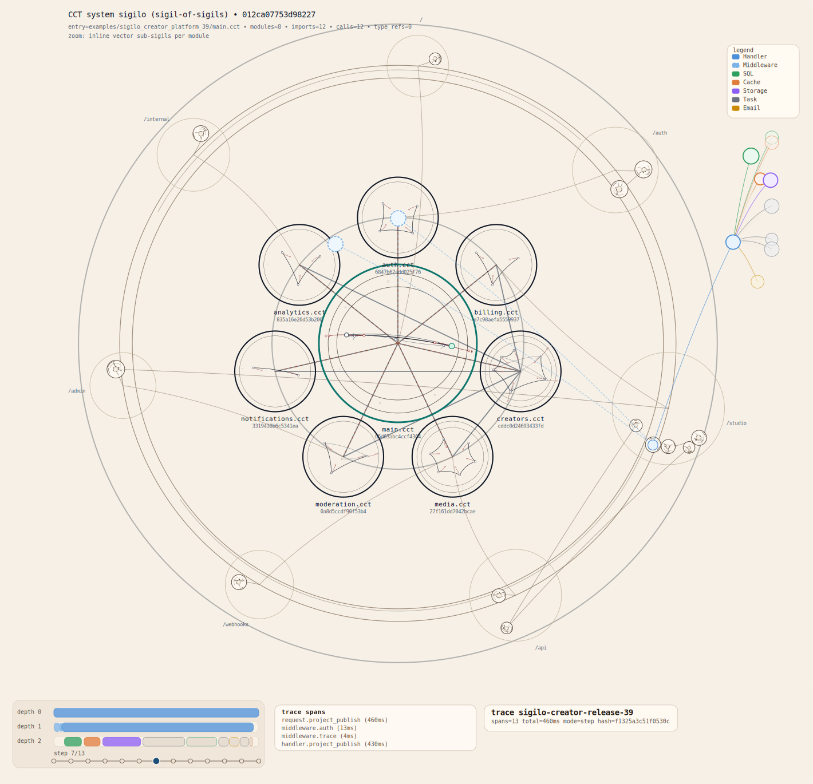
  <p><em>sigilo_creator_platform_39/creator_release_pipeline_39_step.svg — scrubber rail at bottom · drag the knob</em></p>
</div>

```bash
open examples/sigilo_creator_platform_39/creator_release_pipeline_39_step.svg
```

#### Web System — Media Upload Pipeline (animated)

The smaller `sigilo_web_system_35` system: web server + upload + processing modules. Less dense than the creator platform, making it easier to read each individual span category as it arrives. A good starting point before moving to the creator platform trace.

<div align="center">
  
  <p><em>sigilo_web_system_35/media_upload_pipeline_39_animated.svg — 1383×1401 px</em></p>
</div>

```bash
open examples/sigilo_web_system_35/media_upload_pipeline_39_animated.svg
```

#### Web System — Routes-Only Trace (animated)

The upload flow on the routes view: request → auth → upload → transcode → callback. Category colors on the arcs tell the whole story in one compact frame.

<div align="center">
  
  <p><em>sigilo_web_system_35/media_upload_pipeline_39_routes_animated.svg — 960×720 px</em></p>
</div>

```bash
open examples/sigilo_web_system_35/media_upload_pipeline_39_routes_animated.svg
```

#### Web System — Step Mode

Step scrubber on the media upload pipeline. A slower system than the creator platform, so stepping through it is a good introduction to how the step UI feels before tackling the denser trace.

<div align="center">
  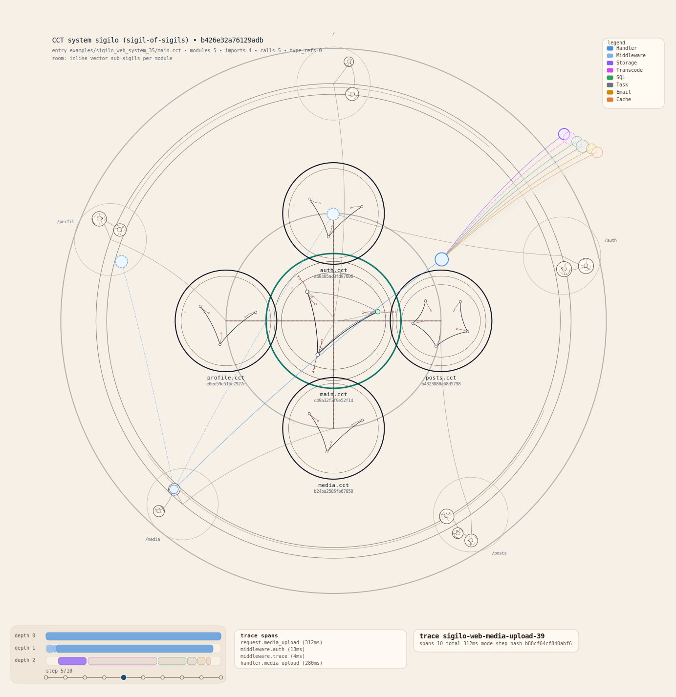
  <p><em>sigilo_web_system_35/media_upload_pipeline_39_step.svg — scrubber included</em></p>
</div>

```bash
open examples/sigilo_web_system_35/media_upload_pipeline_39_step.svg
```

---

### Route and System Sigils

The static structural view — the topology of the program before any trace is overlaid.

#### Creator Platform — Routes Sigil

The base canvas for all the animated traces above. Ten module groups (studio, auth, media, billing, moderation, analytics, notifications, admin, webhooks, internal tasks) arranged as a constellation around the core. Each arc is a declared route; the density here is what makes the animated traces look so complex.

<div align="center">
  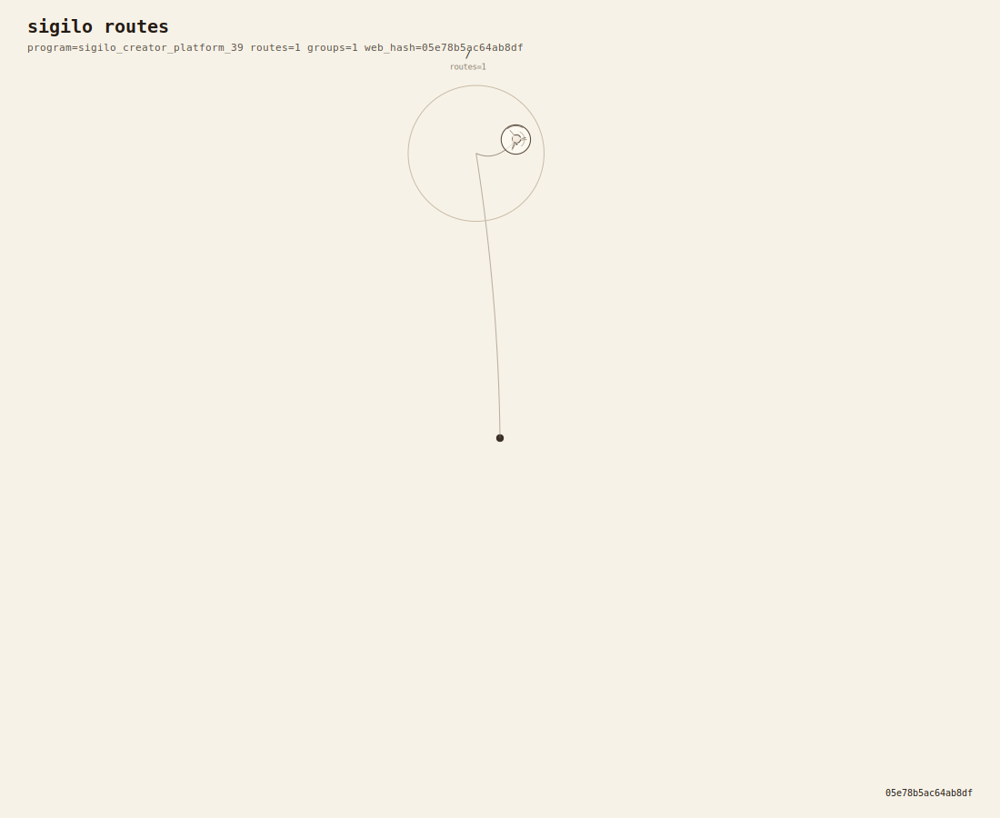
  <p><em>sigilo_creator_platform_39/routes_view.svg — 1100×900 px · hover nodes and arcs in the browser</em></p>
</div>

```bash
open examples/sigilo_creator_platform_39/routes_view.svg
```

#### Web System — Routes Sigil and System View

Two complementary views of the same system. The routes sigil (left) shows the pure route topology; the system view (right) is the composed multi-module sigil — a multi-ring structure where each ring is a module in the closure, with cross-module dependencies as arcs between rings.

<div align="center">
  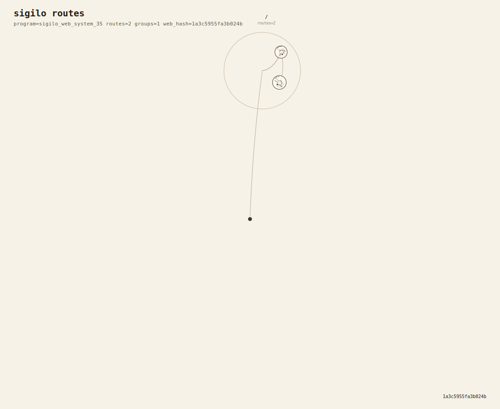
  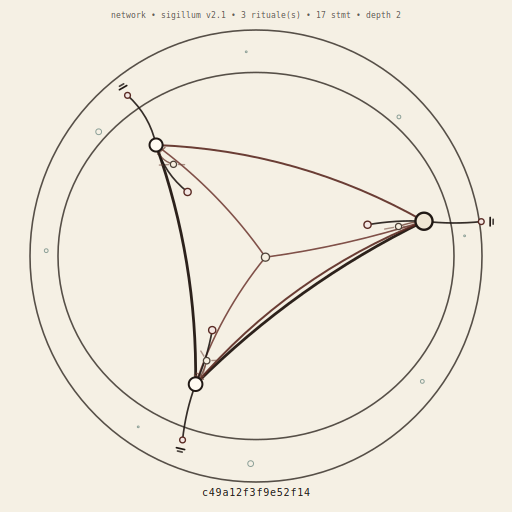
  <p><em>routes_view.svg (1100×900 px) and system_view.svg (512×512 px)</em></p>
</div>

```bash
open examples/sigilo_web_system_35/routes_view.svg
open examples/sigilo_web_system_35/system_view.svg
```

#### Constellation Routes — `sigilo_rotas_constelacao_35.svg`

The largest pure-topology sigil in the repo — 1208×1080 px, 508 lines. The layout algorithm places routes radially around a common core, producing a star-map appearance. No trace overlay; just the structure at rest. A good reference for what a production-scale route set looks like in sigil form.

<div align="center">
  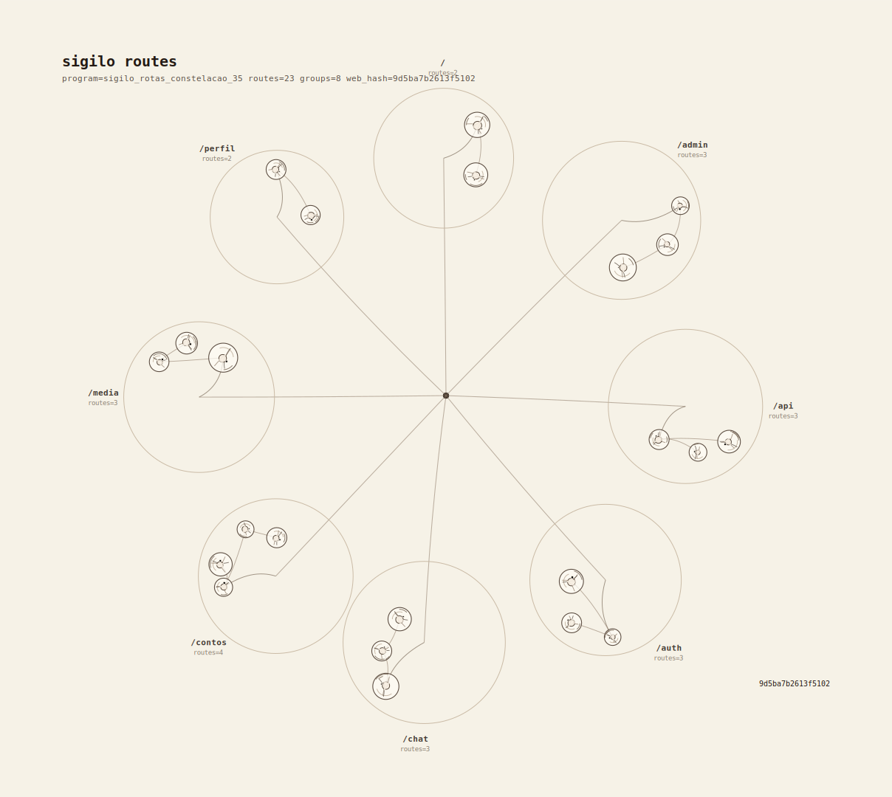
  <p><em>sigilo_rotas_constelacao_35.svg — 1208×1080 px</em></p>
</div>

```bash
open examples/sigilo_rotas_constelacao_35.svg
```

---

### Showcase and Historical Sigils

#### `ars_magna_showcase.svg`

591 lines — the most detailed standard sigil in the examples. `ars_magna_showcase.cct` exercises nearly every language surface: ORDO, SIGILLUM, SERIES, SPECULUM, exception handling, all control flow forms. The resulting sigil is correspondingly rich, with many distinct node types visible in the ring structure.

<div align="center">
  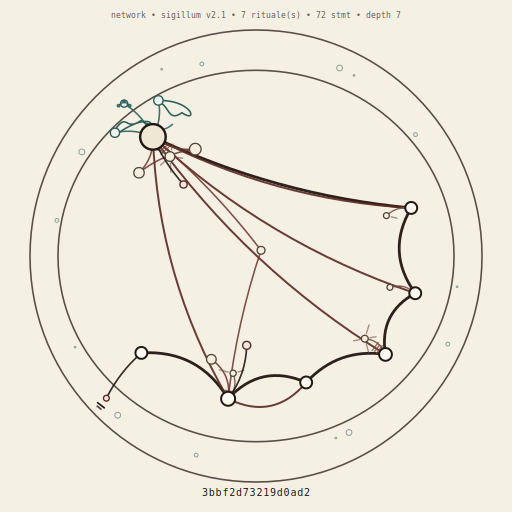
  <p><em>ars_magna_showcase.svg — 512×512 px · 591 lines · comprehensive language tour</em></p>
</div>

```bash
open examples/ars_magna_showcase.svg
```

#### FASE 11H Stdlib Closure — `tmp_sig_11h_complete.svg`

The composed sigil of the complete Bibliotheca Canonica as it stood at FASE 11H — plus **seven individual module sigils** (`__mod_001` through `__mod_007`). The `__mod_001` file alone is 1396 lines, the densest module sigil in the repo. Together they show the full stdlib decomposed module by module.

<div align="center">
  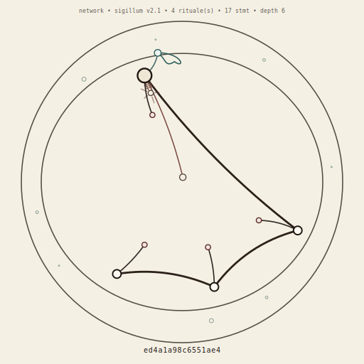
  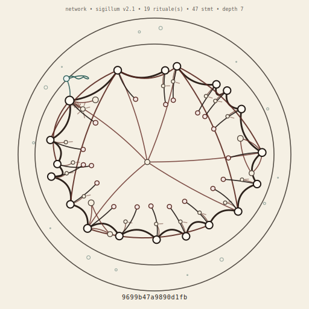
  <p><em>tmp_sig_11h_complete.svg (composed view) and __mod_001.svg (most detailed module, 1396 lines)</em></p>
</div>

```bash
open examples/tmp_sig_11h_complete.svg
open examples/tmp_sig_11h_complete.__mod_001.svg
```

#### FASE 13M Omniversal — two variants

The first sigils generated with the full multi-ring omniversal layout. The variant uses a slightly different arc-routing algorithm; comparing them side by side illustrates how layout parameters affect the output.

<div align="center">
  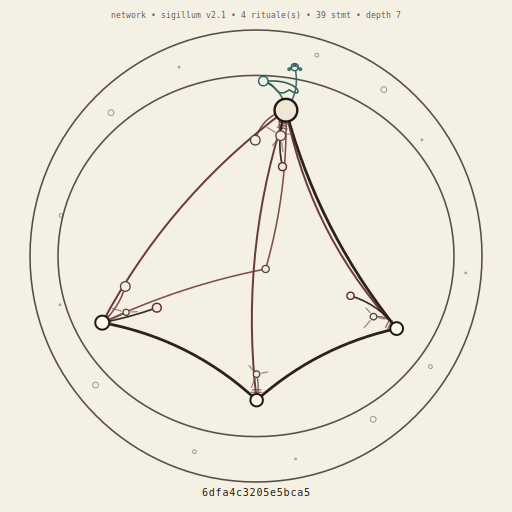
  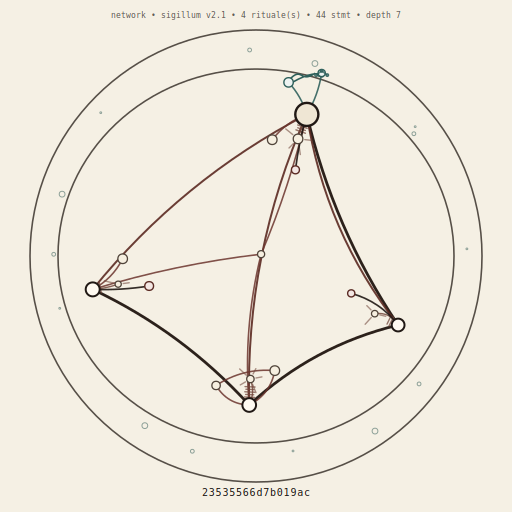
  <p><em>fase13_omniversal_13m.svg and _variant.svg — 512×512 px each</em></p>
</div>

```bash
open examples/fase13_omniversal_13m.svg
open examples/fase13_omniversal_13m_variant.svg
```

#### Log Analyzer — `analisador_log_18_19.svg`

One of the richer single-module sigils: the log analyzer uses `cct/fs`, `cct/io`, `cct/verbum`, `cct/fmt`, and `cct/parse`, so the dependency arc structure is noticeably busier than a simple example. 349 lines.

<div align="center">
  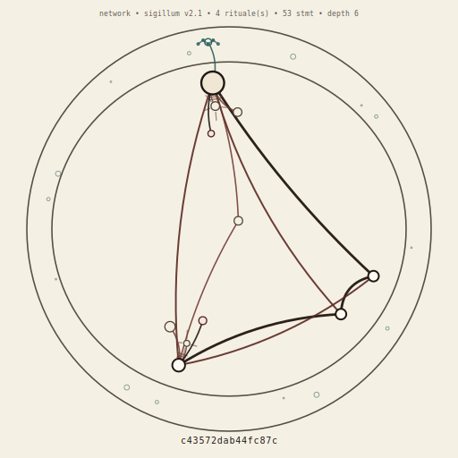
  <p><em>analisador_log_18_19.svg — 512×512 px · 349 lines · multi-stdlib dependency arcs visible</em></p>
</div>

---

### Application Sigils

Each one is the structural fingerprint of a real example program. Smaller and more readable than the system sigils — good for understanding what a sigil looks like for a specific kind of program.

#### Option/Result and Hello

<div align="center">
  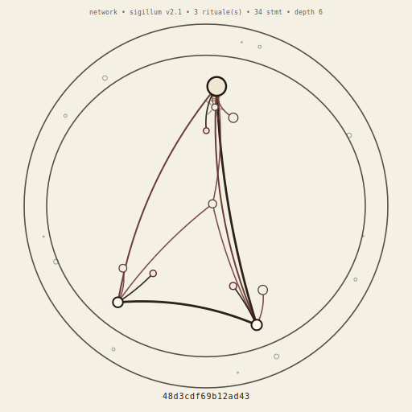
  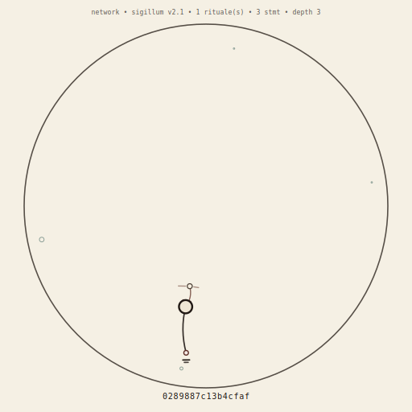
  <p><em>option_result.svg (311 lines · branching Some/None, Ok/Err paths) and hello.svg (109 lines · the simplest possible sigil)</em></p>
</div>

#### SQLite App and Phase 30 Data App

<div align="center">
  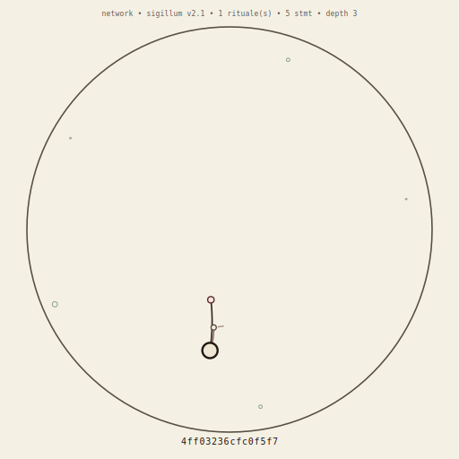
  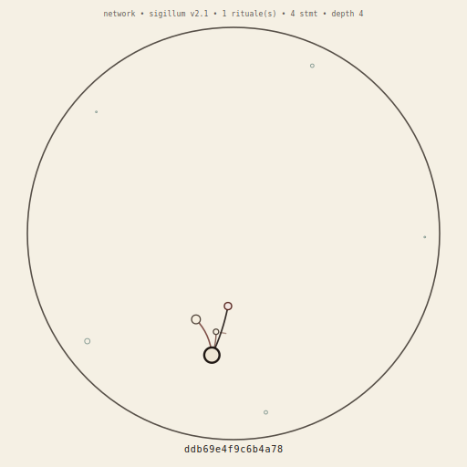
  <p><em>cadastro_sqlite_app (106 lines · config → db → main) and phase30_data_app (125 lines · JSON + SQLite + HTTP)</em></p>
</div>

#### HTTP Server and Config+SQLite App

<div align="center">
  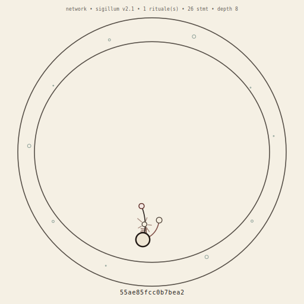
  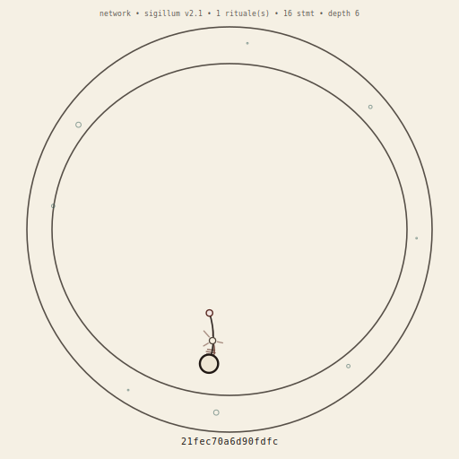
  <p><em>http_simple_server_20f2.svg (minimal arc · single-request server) and config_sqlite_app_20f2.svg (INI + SQLite arc)</em></p>
</div>

---

### Test Suite Sigils

The `cadastro_sqlite_app/tests/` directory contains sigils for the test files themselves — the sigilo system captures test modules as first-class artifacts, not just production code.

<div align="center">
  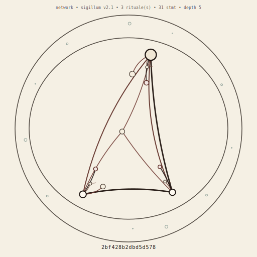
  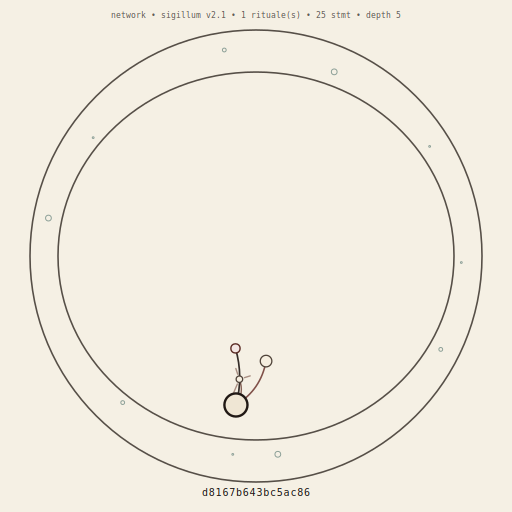
  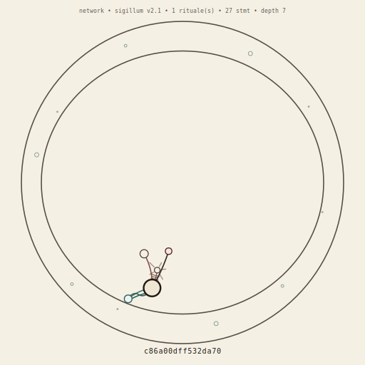
  <p><em>app_flow.test · db_smoke.test · query_filters.test — test topology as sigils</em></p>
</div>

---

### A Note on `.system.svg`

For most examples you will also find a `.system.svg` companion alongside the main `.svg`. The `.system.svg` is the composed multi-module view — it includes the full transitive closure of imported modules, rendered as concentric rings. The plain `.svg` shows only the primary module. For small programs they look similar; for complex apps like `cadastro_sqlite_app` or `sigilo_web_system_35`, the difference is dramatic.

## Application Stack Examples (FASE 20)

### http_simple_server_20f2.cct
Single-request HTTP server returning JSON on `127.0.0.1:8091`.
- `cct/http` request accept/reply flow
- `cct/json` body construction
- explicit `Content-Type` header

```bash
./cct examples/http_simple_server_20f2.cct
./examples/http_simple_server_20f2
```

### http_json_client_20f2.cct
HTTP client consuming JSON from the local server.
- `http_get_json`
- `json_get_key` / `json_expect_*`
- local loopback workflow

Run after starting `http_simple_server_20f2.cct` in another terminal.

```bash
./cct examples/http_json_client_20f2.cct
./examples/http_json_client_20f2
```

### config_sqlite_app_20f2.cct
Configuration-driven SQLite mini app.
- INI parsing with `cct/config`
- local persistence with `cct/db_sqlite`
- explicit project-local file paths under `examples/.tmp`

```bash
./cct examples/config_sqlite_app_20f2.cct
./examples/config_sqlite_app_20f2
```

### udp_loopback_demo_20f2.cct
UDP loopback demo using only project-local host networking.
- `cct/net` high-level UDP helpers
- `cct/socket` timeout control
- `cct/option` unwrap flow for datagrams

```bash
./cct examples/udp_loopback_demo_20f2.cct
./examples/udp_loopback_demo_20f2
```

## Quick Start

```bash
# Compile
cct <example.cct>

# Run the compiled executable
./<example>

# Format code
cct fmt <example.cct>

# Lint code
cct lint <example.cct>
```

## Learning Path

1. **hello.cct** - Start here
2. **fluxus_demo.cct** - Collections basics
3. **iterators.cct** - Iteration patterns
4. **option_result.cct** - Error handling
5. **collection_ops_12d2.cct** - Functional programming
6. **ars_magna_showcase.cct** - Complete tour
7. **http_simple_server_20f2.cct** + **http_json_client_20f2.cct** - Local application protocol flow
8. **config_sqlite_app_20f2.cct** - Config + persistence integration
9. **udp_loopback_demo_20f2.cct** - Host networking basics
10. **lint_showcase_*.cct** - Code quality

## Documentation

- Language spec: `docs/spec.md`
- Standard library: `docs/bibliotheca_canonica.md`
- Architecture: `docs/architecture.md`
- Current phase status and next-step planning: `docs/roadmap.md`
- Historical release packages: `docs/release/`
